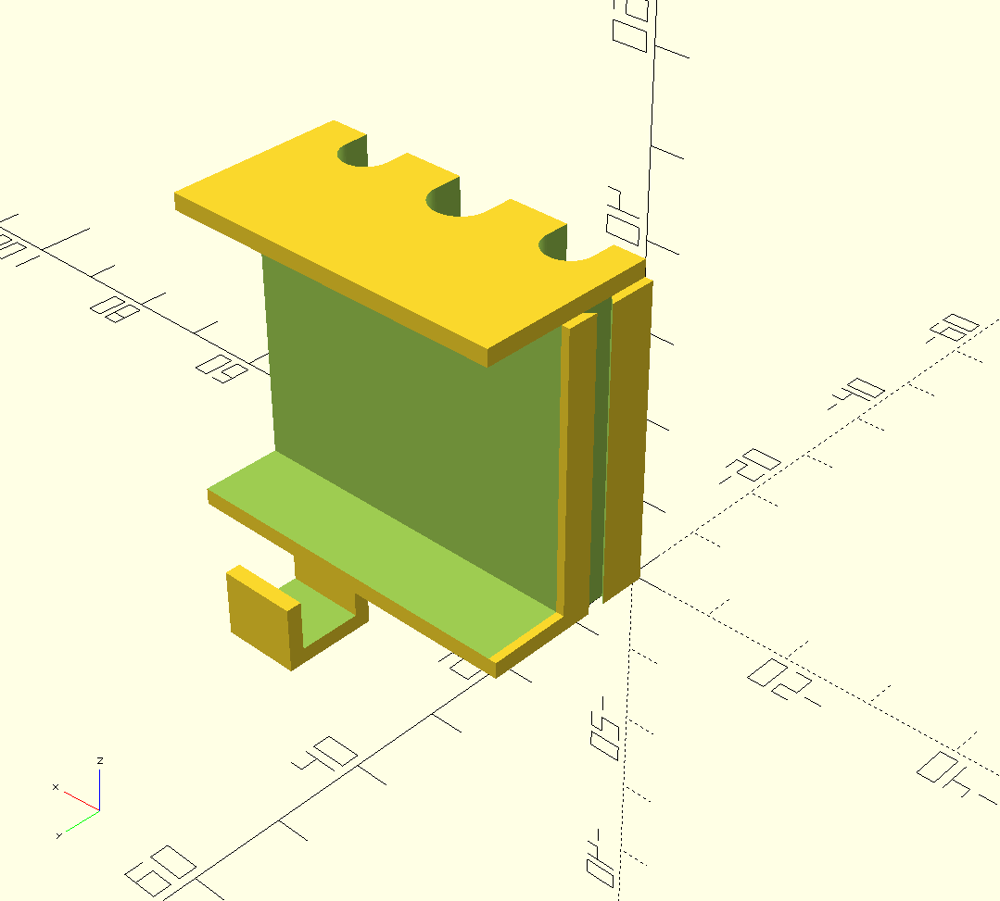

OpenSCAD projects
=================

`OpenSCAD <https://www.openscad.org/>`_ projects for 3D printers.

Desk blocks
-----------

Modular blocks for organizing cables behind and below a desk.

.. figure:: desk-block/.images/Single_block_with_hook.png

.. figure:: desk-block/.images/Single_block.png

Screwable holders
-----------------

Generic screwable U shape holders.

.. figure:: screwable-holder/.images/screwable_holder.png

Extra
-----

To ease developments with OpenSCAD, you can try the `IntelliJ OpenSCAD plugin <https://plugins.jetbrains.com/plugin/11198-openscad-language-support>`_.