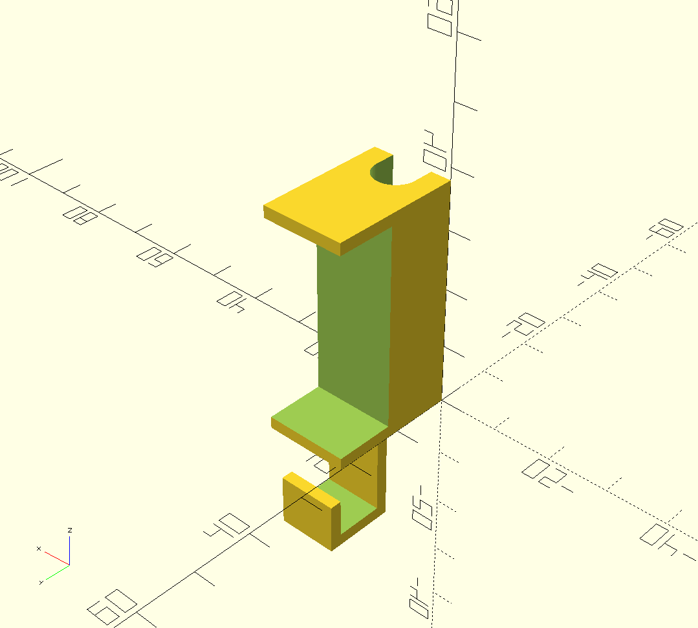
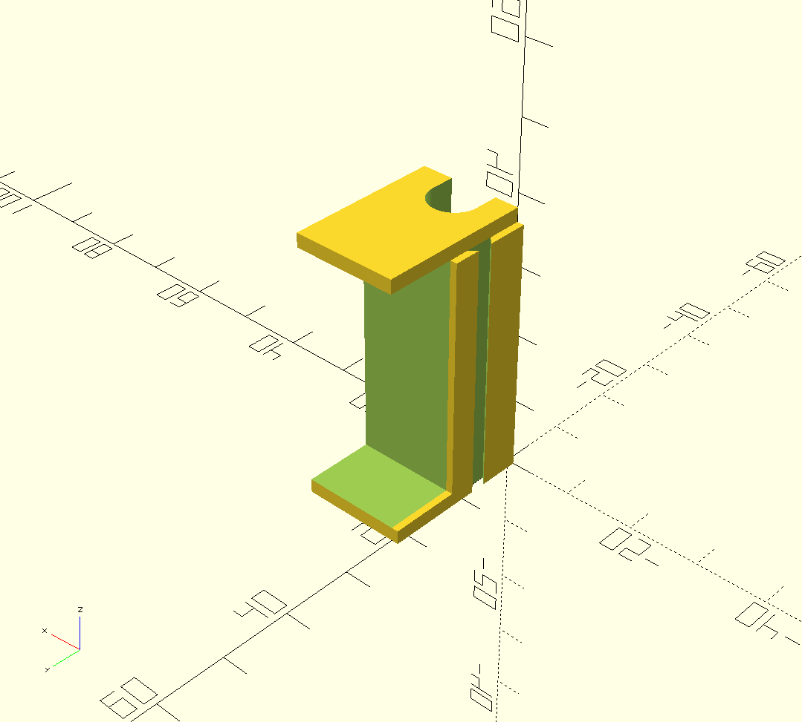
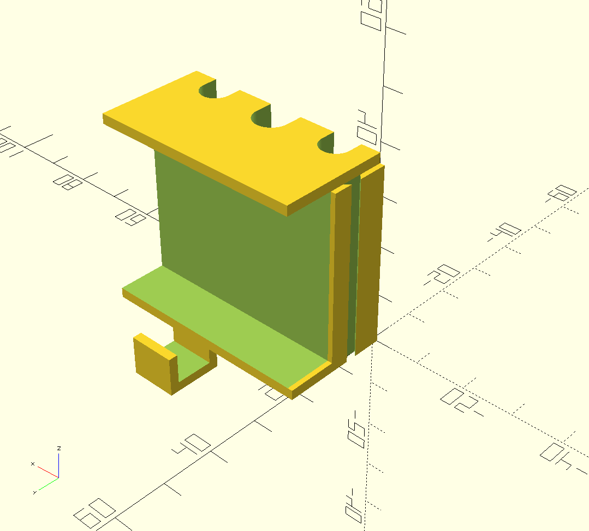

Desk blocks
===========

Desk blocks designed to be placed between a desk and a wall in order to let cables pass through properly and/or provide hooks below the desk to hold cables.

Multiple blocks can be attach together with guide slots on the sides.

Depending of your need, the cable hole, the hook and the guide slots are optional, the size of the cable hole (if any) is configurable.

Usage
-----

The :code:`deskBlock` module has the following parameters :

- desk_height (mm) : thickness of your desktop
- cable_max_diameter (mm) : maximum diameter of cables you will pass in the desk : mandatory to align depth of all the blocks you will print for a given desk
- cable_diameter (mm) : diameter of the cable you will pass for this piece. If set to 0, no cable passthrough is generated
- with_hook (boolean) : set to :code:`true` to generate a hook below the piece, :code:`false` otherwise
- with_left_slot (boolean) : set to :code:`true` to generate a guide slot on the left of the block, :code:`false` otherwise
- with_right_slot (boolean) : set to :code:`true` to generate a guide slot on the right of the block, :code:`false` otherwise

Examples
--------

Single block
++++++++++++

Run :code:`deskBlock(34, 10, 7, false, true, true);` if :

- Your desk is 34mm thick
- The biggest cable you will pass through is 10mm diameter
- The cable you will pass through this block is 7mm diameter
- You do not need a hook
- You need guide slot at each side of the block to attach two other blocks on each sides of this one

Joint blocks
++++++++++++

As explained, you can print several single blocks and join them together with the guide slots. If you prefer printing a single piece with several blocks joined together, you can simply do :

::

    deskBlock(34, 10, 6, false, true, false);
    translate([14, 0, 0]) deskBlock(34, 10, 7, false, false, false);
    translate([14*2, 0, 0]) deskBlock(34, 10, 6, true, false, true);

The value of the translation, here :code:`14`, depends of your configuration. Maximum should be :code:`cable_max_diameter + 4`. You can reduce this number depending of the size of the cable holes and the presence of hooks.
This example will generate a single piece with 3 cable holes, one with a hook, guide slot on each sides.
