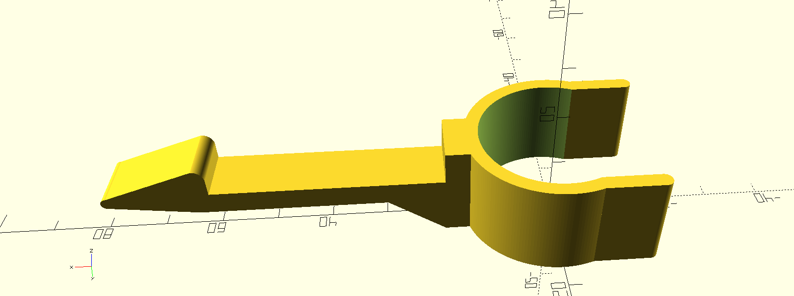
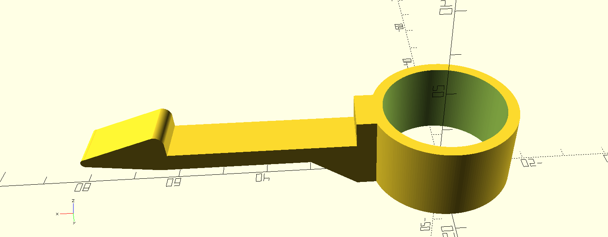
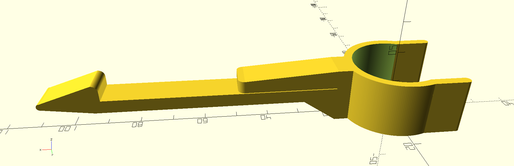

Door stopper lock
=================

Customizable cylindrical door stopper lock for easy lock/unlock.

Customisation on the diameter of the stopper, door thickness and optional extra space between the bumper and the closed door.

Open lock without spacer :

Closed lock without spacer :

Open lock with spacer :

Configuration
-------------

Mandatory configuration
+++++++++++++++++++++++

Door stopper
************

::

               __________
               |        |
             | ←-bumper-→ |
               |        |        ↑ base height
    ___________|________|________↓
                ←-base-→

stopper_base_diameter : Diameter of the base of the stopper (between the floor and the bumper).
stopper_base_height : Height in mm between the floor and the bumper.
stopper_bumper_diameter : Diameter of the bumper
closed_stopper_holder : False to generate a removable lock. True to generate a lock that will completely surround the base of the stopper. Requires to unscrew/screw the stopper.
door_thickness : Thickness of the door.
door_to_floor_height : Height in mm of the space between the floor and the bottom of the door.

Optional configuration
++++++++++++++++++++++

Spacer
******

Useful if you want to lock the door away from the bumper.

stopper_spacer : 1 to generate a spacer, 0 to skip it.
stopper_spacer_length : Extra length between the bumper and the locked door.

Links
-----

View it in `thingiverse <https://www.thingiverse.com/thing:4263358>`_.