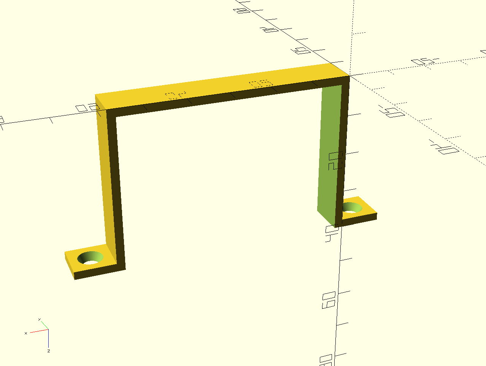

Screwable holder
================

Configurable screwable U shape holder.

Usage
-----

The :code:`screwableHolder` module has the following parameters :

- h (mm) : Height
- w (mm) : Width
- d (mm) : Depth
- s (mm) : Screw diameter, default is 4 mm
- t (mm) : Thickness of the plastic, default is 2 mm

::

           _______                    _______
          /__O__ /|                  /__O__ /
                 ||__________________||         ↑h
      d/         |/__________________|/         ↓
                 ←-------- w -------→

Examples
--------

screwableHolder(h = 38, w = 54, d = 10);